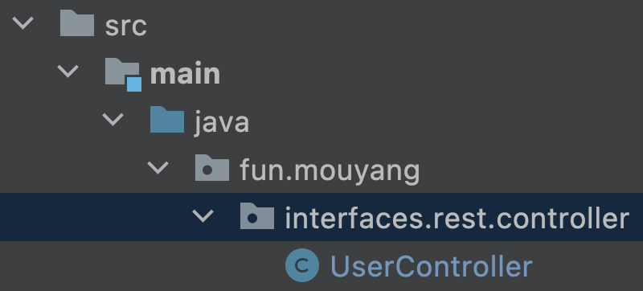

# openapi-demo
Describe how to generate REST API interfaces using OpenAPI specifications.

---

## 1. Create a new Spring Project using Spring Initializr
Provide the configuration in the below image.


## 2. Create "OpenAPI specifications" in /src/main/resources/static/openapi


---
## 3. Update build.gradle
### 3-1-1. Add [springdoc openapi starter dependency](https://springdoc.org/) for creating swagger ui
### 3-1-2. Adjust the dependencies block to make it more clear and readable
```groovy
dependencies {
    // spring
    implementation 'org.springframework.boot:spring-boot-starter-web'

    // openapi
    implementation 'org.springdoc:springdoc-openapi-starter-webmvc-ui:2.1.0'
    implementation 'org.openapitools:jackson-databind-nullable:0.2.6'

    // lombok
    compileOnly 'org.projectlombok:lombok'
    annotationProcessor 'org.projectlombok:lombok'

    // test
    testImplementation 'org.springframework.boot:spring-boot-starter-test'
}
```

### 3-2. Add [openapi java generator plugin](https://openapi-generator.tech/) to plugin block for code generation
```groovy
plugins {
    id 'java'
    id 'org.springframework.boot' version '3.1.1'
    id 'io.spring.dependency-management' version '1.1.0'
    id "org.openapi.generator" version "6.6.0"
}
```

### 3-3. Set the [configuration parameters](https://github.com/OpenAPITools/openapi-generator/blob/master/modules/openapi-generator-gradle-plugin/README.adoc) for the openApiGenerate task provided by the plugin
Parameters contain the generator, location of the openapi spec, output directory, and the package name for the generated interfaces and models.
```groovy
openApiGenerate {
	generatorName = 'spring'
	inputSpec = file("${projectDir}/src/main/resources/static/openapi/user.yaml").toString()
	outputDir = file("${buildDir}/generated/openapi").toString()
	apiPackage = 'fun.mouyang.interfaces.rest.controller'
	modelPackage = 'fun.mouyang.interfaces.rest.dto'
	configOptions = [
		useSpringBoot3: "true",
		interfaceOnly: "true"
	]
}
```

### 3-4. Add the directory that contains the generated interfaces and models to the project source sets
```groovy
sourceSets {
    main {
        java {
            srcDir 'src/main/java'
            srcDir "${buildDir}/generated/openapi/src/main/java"
        }
    }
}
```

### 3-5. Execute the openApiGenerate task during gradle build process
```groovy
compileJava.dependsOn tasks.openApiGenerate
```

---

## 4. Create [UserController](src/main/java/fun/mouyang/interfaces/rest/controller/UserController.java) in fun.mouyang.interfaces.rest.controller


---

## 5. swagger-ui is enable by default if "springdoc-openapi-starter" is in the dependencies block
You can open the browser and navigate to [localhost](http://localhost:8080/swagger-ui/index.html) to execute some requests after starting the application.


### 5.1 Render Swagger UI by OpenAPI specifications instead of examining application at runtime
Add below configuration to application.properties
```properties
springdoc.swagger-ui.url = openapi/user.yaml
```
Check out the red block in the picture


---

## 6. Multiple OpenAPI specifications
Since openapi-generator doesn't support generating code from multiple OpenAPI specifications in a single task yet, we need to create a customized task and utilize the GenerateTask to do so.

### 6-1. Import the GenerateTask class in build.gradle
```groovy
import org.openapitools.generator.gradle.plugin.tasks.GenerateTask
```

### 6-2. Replace the openApiGenerate task with below customized task
```groovy
task openApiMultipleGenerate {
	def openapiDirectory = file("${projectDir}/src/main/resources/static/openapi")
	openapiDirectory.eachFileRecurse() {spec ->
		tasks.create("openApiGenerate-${spec.getName()}", GenerateTask.class, {
			generatorName = 'spring'
			inputSpec = file("${projectDir}/src/main/resources/static/openapi/${spec.getName()}").toString()
			outputDir = file("${buildDir}/generated/openapi").toString()
			apiPackage = 'fun.mouyang.interfaces.rest.controller'
			modelPackage = 'fun.mouyang.interfaces.rest.dto'
			validateSpec = false
			configOptions = [
				useSpringBoot3: "true",
				interfaceOnly: "true"
			]
		})
		dependsOn "openApiGenerate-${spec.getName()}"
	}
}
```

### 6-3. Replace the dependsOn task from tasks.openApiGenerate to tasks.openApiMultipleGenerate
```groovy
compileJava.dependsOn tasks.openApiMultipleGenerate
```

### 6-4. Add all OpenAPI specifications to application.properties
```properties
springdoc.swagger-ui.urls[0].name = user
springdoc.swagger-ui.urls[0].url = openapi/user.yaml
springdoc.swagger-ui.urls[1].name = image
springdoc.swagger-ui.urls[1].url = openapi/image.yaml
```
You can choose to view different specs in separate pages now.
